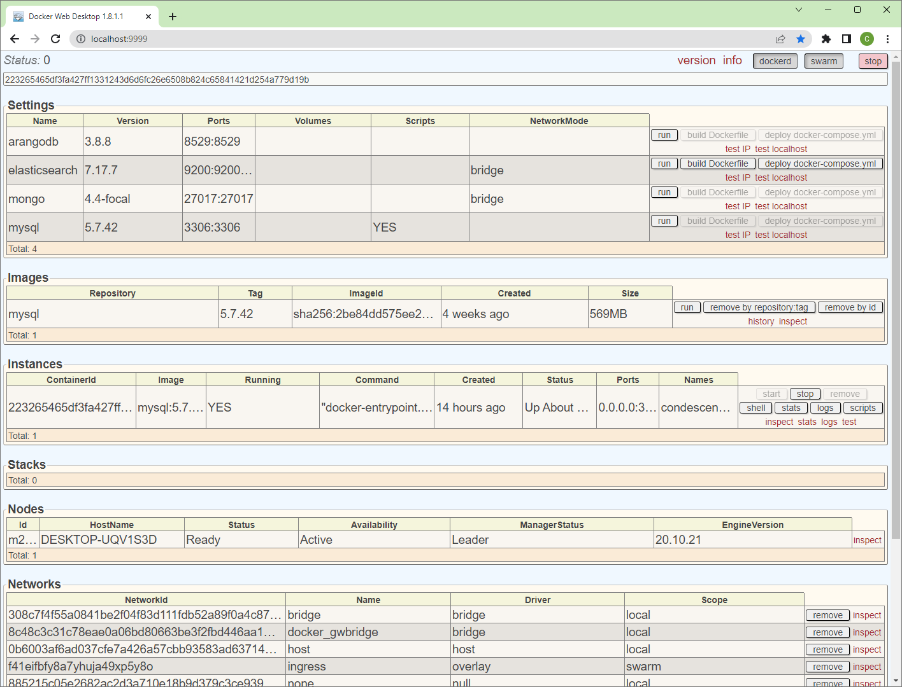

DockerWebDesktop-Core
=====================

C# REST service with HTML interface running on Linux to manage Docker containers (_serviço REST em C# com interface HTML rodando​ em Linux para gerenciar containers Docker_).

 

# Demo:

<!--    -->
  

# Dependencies:

 - https://github.com/crisstanza/CSharpUtils-Core
 - https://github.com/crisstanza/CommandLiner-Core

 

| DockerWebDesktop-Core | CommandLiner-Core | CSharpUtils-Core |
| :-------------------: | :---------------: | :--------------: |
| <b>1.8.2.2</b>        | 0.7.0.1           | 0.7.1.1          |
| <b>1.8.1.1</b>        | 0.7.0.1           | 0.7.1.0          |
| <b>1.7.0.1</b>        | 0.7.0.1           | 0.7.0.1          |
| <b>1.7.0.0</b>        | 0.7.0.0           | 0.7.0.0          |
| <b>1.1.5.1</b>        | 0.3.0.0           | 0.3.0.1          |
| <b>1.1.5.0</b>        | 0.3.0.0           | 0.3.0.0          |

 

## Install Ubuntu on Windows:

Open "Command Prompt" as Administrador and:

List available:

	wsl --list --online

Install:

	wsl --set-default-version 2
	wsl --install -d Ubuntu-22.04

Restart your machine and, after that, create your Ubuntu user.

Check your version (inside Ubuntu):

	lsb_release -a

If you want to reboot Ubuntu:

	wsl --shutdown

Other commands:
	wsl --unregister Ubuntu

## Install .NET Core on Ubuntu:

Ubuntu 20.04:

	wget https://packages.microsoft.com/config/ubuntu/20.04/packages-microsoft-prod.deb
	sudo dpkg -i packages-microsoft-prod.deb
	rm packages-microsoft-prod.deb

	sudo apt update ; sudo apt install apt-transport-https
	# sudo apt install dotnet-runtime-3.1
	sudo apt install dotnet-sdk-3.1

Ubuntu 22.04:

	wget https://packages.microsoft.com/config/ubuntu/22.04/packages-microsoft-prod.deb ; \
	sudo dpkg -i packages-microsoft-prod.deb ; \
	rm packages-microsoft-prod.deb

	sudo snap remove dotnet-sdk
	sudo apt remove 'dotnet*'
	sudo apt remove 'aspnetcore*'
	sudo apt remove 'netstandard*'
	sudo rm /etc/apt/sources.list.d/microsoft-prod.list
	sudo rm /etc/apt/sources.list.d/microsoft-prod.list.save

	sudo apt update ; sudo apt install -y dotnet-sdk-7.0

## Install Docker on Ubuntu:

	sudo apt update ; sudo apt install -y docker.io

### If you face some iptables issue, try this:

	- make sure you are running WSL 2: 
		wsl -l -v
		wsl --status
	sudo update-alternatives --set iptables /usr/sbin/iptables-legacy ; sudo update-alternatives --set ip6tables /usr/sbin/ip6tables-legacy

### If you face dockerd issue, try this:

	docker system prune --volumes -f 
	sudo rm /var/lib/docker/volumes/metadata.db

## Usage example:

	export DWD_PORT=9876 ; sudo -E dotnet run
or
	
	sudo ./SCRIPTS/bash.bash run

Another examples:

	export DWD_DEBUG=true ; sudo -E ./SCRIPTS/bash.bash run
	export DWD_CHECK_FOR_UPDATES_INTERVAL=5 ; sudo -E ./SCRIPTS/bash.bash run
	unset DWD_CHECK_FOR_UPDATES_INTERVAL ; sudo -E ./SCRIPTS/bash.bash run

### Environment variables:

	- DWD_DEBUG - true|false - show docker commands on the console
	- DWD_SUBNET_MASK - your network subnet mask
	- DWD_HOST - do not use!
	- DWD_PORT number - port where to listen to
	- DWD_CHECK_FOR_UPDATES_INTERVAL - check for latest version interval in minutes
	- DWD_SETTINGS_HOME - directory path, ending with /

### VSCode Extensions:

	- C# - v1.25.2 - Microsoft - C# for Visual Studio Code (powered by OmniSharp)
	- dotnet --list-sdks
	- for Ubuntu: sudo ./dotnet-install.sh -c 6.0 --install-dir /usr/share/dotnet

### Git:

	git config user.email "crisstanza@users.noreply.github.com"
	git config user.name "Cris Stanza"

### Links:

	https://www.digitalocean.com/community/tutorials/how-to-install-docker-compose-on-ubuntu-18-04
	https://docs.docker.com/compose/compose-file/compose-file-v2/#restart
	https://stackoverflow.com/questions/39388877/adding-files-to-standard-images-using-docker-compose
	https://learn.microsoft.com/en-us/answers/questions/724536/dmesg-showing-only-5-lines
	https://learn.microsoft.com/en-us/dotnet/api/system.net.ipaddress?view=net-7.0
	https://www.omgubuntu.co.uk/how-to-install-wsl2-on-windows-10
	https://chmod-calculator.com/
	https://geshan.com.np/blog/2022/02/mysql-docker-compose/
